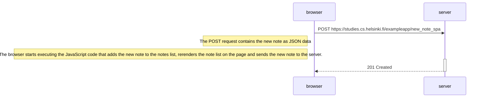

```mermaid

sequenceDiagram
    participant browser
    participant server

    browser->>server: POST https://studies.cs.helsinki.fi/exampleapp/new_note_spa

   Note left of browser: The POST request contains the new note as JSON data


    Note left of browser: The browser starts executing the JavaScript code that adds the new note to the notes list, rerenders the note list on the page and sends the new note to the server.

    activate server
    server-->>browser: 201 Created
    deactivate server


```
